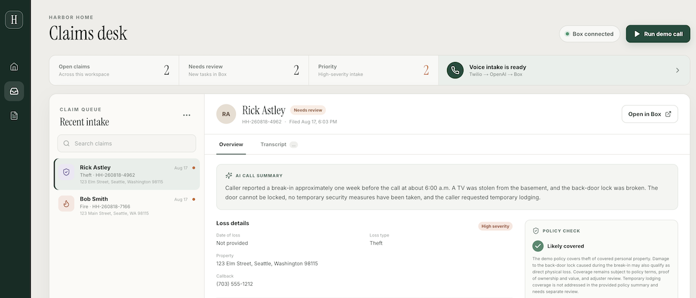

# Harbor FNOL Demo

A homeowner calls a Twilio number, speaks with an OpenAI intake agent, and the completed first notice of loss is stored in Box. OpenAI extracts reported facts only. Box AI compares the FNOL with a sample homeowners policy. The Markdown report, `global/properties` metadata, and review task live in Box. The Next.js dashboard reads that folder; there is no application database.

Demo only — analysis is preliminary and needs human review. [Vercel Services](https://vercel.com/kb/guide/vercel-services) are in beta.

## Architecture

One Vercel project and domain (`vercel.json`): `/` and `/api/*` go to Next.js (`app/`, `lib/`); `/voice/*` goes to the Agent Connect container (`src/voice/server.ts`, `Dockerfile.vercel`).

```text
Homeowner → Twilio → /voice/twiml ↔ /voice/ws → OpenAI interview
                                              → call ends
                         OpenAI fact extraction → Box intake report + metadata
                         Box AI (report + data/homeowners-policy.md)
                         final report version + metadata + review task
                         dashboard reads Box (refresh after a live call)
```

Startup uploads `data/homeowners-policy.md` into `BOX_FOLDER_ID` (default `0`) and versions it when the local file changes.

## Configure

Needs Node 22.13+, npm, and the [Vercel CLI](https://vercel.com/docs/cli) for `dev:all` and deploy. Live calls also need an OpenAI key, a Twilio voice number, a Box Business+ enterprise with Box AI, a Box Admin to authorize the app, and [ngrok](https://ngrok.com/download) for local voice.

```bash
npm install
cp .env.example .env.local
```

Both services read `.env.local`.

**OpenAI** — [API key](https://platform.openai.com/api-keys). Used for spoken replies and structured FNOL extraction. `OPENAI_MODEL` defaults to `gpt-5.6`.

**Box CCG** — In the [Developer Console](https://app.box.com/developers/console), create a Client Credentials Grant Platform App. Enable **Read and write all files and folders** and **Manage AI**. App Access Only is enough when files stay in the Service Account's folders; App + Enterprise Access is required to use an existing enterprise folder or assign tasks. A Box Admin must enable Box AI API access and authorize the app (reauthorize after any scope change). Set `BOX_CLIENT_ID`, `BOX_CLIENT_SECRET`, and `BOX_ENTERPRISE_ID`. Optional: `BOX_FOLDER_ID`, `BOX_REVIEWER_USER_ID`. Collaborate the Service Account on any folder it does not own. Server-side Box calls use the official [`box`](https://www.npmjs.com/package/box) package through its `box/sdk` entry point.

**Twilio** — Account SID, Auth Token, API key SID + secret, and an E.164 voice number.

## Run locally

Dashboard only (bundled sample claims if Box is unset):

```bash
npm run dev   # http://localhost:3000
```

**Run demo call** processes a bundled transcript. With OpenAI and Box configured, that path also writes the report and task to Box.

Full voice stack — tunnel port 3000, set `TWILIO_VOICE_PUBLIC_DOMAIN` to the ngrok hostname only, then start both services:

```bash
ngrok http 3000
npm run dev:all   # vercel dev -L
```

Point the Twilio number's incoming-call webhook (POST) at `https://<host>/voice/twiml`. `curl https://<host>/voice/health` should return `{"status":"ok","service":"harbor-voice"}`.

Without the Vercel gateway: `npm run dev` and `npm run voice:dev` in two terminals, tunnel port `8080`, same `/voice/twiml` path.

## Deploy

1. Import the repo. In **Build and Deployment**, set Framework Preset to **Services** (required, or Vercel ignores `services` in `vercel.json`).
2. Add the variables from `.env.example`. Do not set `PORT` or `HOST`.
3. Deploy with Git or `npm run deploy:production`. Vercel builds the voice container from `Dockerfile.vercel`.
4. Set the Twilio webhook to `https://<domain>/voice/twiml` and confirm `/voice/health`.

Leave `TWILIO_VOICE_PUBLIC_DOMAIN` empty to use the Vercel hostname (`VERCEL_PROJECT_PRODUCTION_URL` or `VERCEL_URL`). Set it for a custom domain. Hostname only, no scheme or path.

Call the Twilio number, hang up, wait a few seconds, then refresh the dashboard. Preview and production share one URL per deploy; WebSocket length follows the plan's function duration limit.

## Troubleshooting

| Symptom | Likely cause |
| --- | --- |
| Dashboard shows **Demo data** | Missing any of the three Box CCG values; restart after editing `.env.local`. |
| `/voice/health` is a Next.js 404 | Framework Preset is not **Services**, or the deploy predates `vercel.json`. |
| `unauthorized_client` / `invalid_grant` | App not authorized, or client ID/secret/enterprise do not match. |
| Box `403` or missing folder | Scope, numeric `BOX_FOLDER_ID`, or Service Account access. |
| Box AI unavailable | Box AI API off, missing **Manage AI**, or no reauthorization. Claim stays in Box as **Needs review**. |
| Call drops immediately | Health check host ≠ Twilio webhook host; webhook not POST `/voice/twiml`; public domain includes `https://`. |
| Call works, no claim | Extraction runs after hangup. Check voice logs and OpenAI/Box env, then refresh. |

Do not expose claim data without auth. Twilio Agent Connect is not HIPAA- or PCI-eligible.

## Resources

- [Vercel Services](https://vercel.com/kb/guide/vercel-services)
- [Twilio Agent Connect](https://www.twilio.com/docs/conversations/agent-connect/quickstart)
- [Box CCG setup](https://developer.box.com/guides/authentication/client-credentials/client-credentials-setup)
- [Box AI prerequisites](https://developer.box.com/guides/box-ai/ai-tutorials/prerequisites)
- [Box NPM package](https://www.npmjs.com/package/box)
